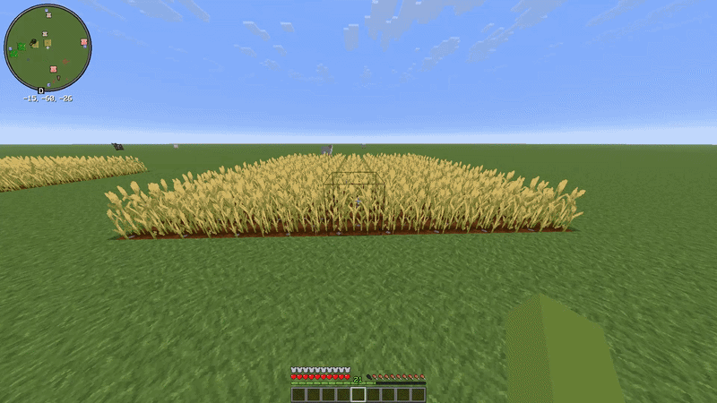

<div align="center">

# ⛏️ VeinBreaker

**Mine entire ore veins, geode formations, and cave structures, fell whole trees, harvest crops, and place blocks with outward ripple animations.**

<<<<<<< HEAD
[](https://github.com/Usama-Balhasal/VeinBreaker/releases)
[](https://www.spigotmc.org/)
=======
[](https://github.com/Usama-Balhasal/Veinbreaker/releases)
[](https://www.spigotmc.org/)
>>>>>>> a80de220df9e4b50642bc3825b10494e0e5a54a3
[](LICENSE)
[](https://hub.spigotmc.org/)

*A lightweight, highly configurable quality-of-life plugin built for survival servers.*

<<<<<<< HEAD
[🌐 Website](https://www.vlx.world/) · [🐛 Report a Bug](https://github.com/Usama-Balhasal/VeinBreaker/issues) · [💡 Request a Feature](https://github.com/Usama-Balhasal/VeinBreaker/issues)

<br>

### 🎬 Live Demo

=======
[🌐 Website](https://www.iceforge.world/) · [🐛 Report a Bug](https://github.com/Usama-Balhasal/Veinbreaker/issues) · [💡 Request a Feature](https://github.com/Usama-Balhasal/Veinbreaker/issues)
>>>>>>> a80de220df9e4b50642bc3825b10494e0e5a54a3

</div>

---

## ✨ Features

| Feature | Description |
|---|---|
| ⛏️ **Ore Vein Mining** | Break an entire connected ore vein with a single swing across Overworld, Nether, and Deepslate |
| 💎 **Geode Mining** | Harvest Amethyst clusters, buds, blocks, calcite, and smooth basalt simultaneously |
| 🪨 **Cave Formations** | Mine pointed dripstone, dripstone blocks, sculk structures, tuff variants, and raw ore blocks |
| 🌲 **Tree Felling** | Chop down whole trees (logs, wood, and giant trunks) and cleanly clear leaf canopies |
| 🌾 **Crop Harvesting & Replant** | Harvest mature crop patches in one swing with automatic, instant age-0 replanting |
| 🌊 **Outward Progressive Animation** | Watch blocks break or place in timed outward ripple waves with escalating acoustic chimes |
| 🧱 **Outward Block Placement** | Place matching blocks sequentially outward in 2D planes while sneaking |
| 🛡️ **Prevent Tool Break** | Automatically halts vein mining when tool durability hits 1, saving your max-tier tools |
| 🎒 **Direct-to-Inventory Drops** | Routes mined items directly into your inventory so drops never fall into lava or dark ravines |
| ⚡ **XP Auto-Collection** | Grants vanilla-accurate XP directly to your experience bar without entity orb clutter |
| 🎮 **Flexible Activation Modifiers** | Choose always-on (`/vb`), sneak-to-activate (Shift), or sprint-to-activate (Ctrl) modes |
| 🔮 **Multi-Layer Particle Juice** | Full block break effects (`Effect.STEP_SOUND`), 25-particle bursts, and mineral sparkles |
| 🛡️ **Unbreaking Formula Respect** | Accurately calculates vanilla Unbreaking enchant math for fair durability consumption |
| 🧩 **Proximity Vein Detection** | 3x3x3 26-neighbor scanning bridges diagonal gaps so veins aren't cut short |
| 🛡️ **Budding Amethyst Protection** | Optional safeguard protects budding amethyst blocks to preserve crystal spawners |
| 🏗️ **Creative Mode Clearing** | Supports Creative mode for rapid world clearing without dropping clutter |
| 💾 **Persistent Toggle State** | Player preferences (`/vb`, `/vb place`, `/vb anim`) persist across reboots via `playerdata.yml` |
| ⏱️ **Independent Cooldowns** | Per-feature cooldown timers to prevent spam and preserve server performance |
| 🌍 **World Blacklist** | Disable VeinBreaker functionality in specific worlds (e.g., spawn, hubs, minigames) |
| 🎨 **Rich Color Messages** | All chat messages support standard Minecraft `&` color formatting and placeholders |
| ♻️ **Live In-Game Reload** | `/vb reload` refreshes `config.yml` and player caches without restarting the server |
| 🚀 **1.21.x - 26.2 Compatibility** | Fully tested and compatible across Spigot, Paper, and modern server forks |

---

## 📦 Installation

<<<<<<< HEAD
1. Download the latest `VeinBreaker-2.0.0.jar` from the [Releases](https://github.com/Usama-Balhasal/VeinBreaker/releases) page.
2. Place the JAR into your server's `plugins/` directory.
=======
1. Download the latest `VeinBreaker-x.x.x.jar` from the [Releases](https://github.com/Usama-Balhasal/Veinbreaker/releases) page.
2. Drop it into your server's `/plugins/` folder.
>>>>>>> a80de220df9e4b50642bc3825b10494e0e5a54a3
3. Restart or reload your server.
4. Customize `plugins/VeinBreaker/config.yml` to your liking.
5. Execute `/vb reload` to apply configuration changes instantly without a server restart.

**Requirements:**
- Minecraft **1.21.x - 26.2**
- Spigot or Paper (Paper highly recommended for optimal scheduler performance)
- Java 21+

---

## 🎮 Commands

All commands support both `/veinbreaker` and the shorthand `/vb`.

| Command | Permission | Description |
|---|---|---|
| `/vb` | `veinbreaker.use` | Toggle VeinBreaker on/off (persisted per player) |
| `/vb toggle` | `veinbreaker.use` | Alias for toggle |
| `/vb place` | `veinbreaker.use` | Toggle outward sequential block placement |
| `/vb anim` | `veinbreaker.use` | Toggle progressive outward ripple animation |
| `/vb status` | `veinbreaker.use` | Display active player preferences, modifiers, and server limits |
| `/vb help` | `veinbreaker.help` | View complete command list and usage |
| `/vb reload` | `veinbreaker.reload` | Reload configuration and player data live |
| `/vb permission add <node>` | `veinbreaker.admin` | Add a custom permission node to the allowed use list |
| `/vb permission remove <node>` | `veinbreaker.admin` | Remove a permission node from the allowed use list |

---

## 🔑 Permissions

| Permission | Default | Description |
|---|---|---|
| `veinbreaker.use` | OP | Allows toggling and using VeinBreaker mining features |
| `veinbreaker.admin` | OP | Grants access to all administrative commands |
| `veinbreaker.reload` | OP | Grants permission to execute `/vb reload` |
| `veinbreaker.help` | Everyone | Grants permission to view `/vb help` |

> [!TIP]
> You can add custom permission nodes from third-party plugins directly in `config.yml` under `permissions.use` or via `/vb permission add <node>`.

---

## 🔍 In-Depth Features

### ⛏️ Ore, Geode & Cave Mining
VeinBreaker groups connected blocks by mineral family:
- **Ores:** Coal, Iron, Copper, Gold, Redstone, Lapis, Diamond, Emerald, Nether Gold, Nether Quartz, Ancient Debris, and Deepslate variants.
- **Raw Ore Blocks:** Mega cave veins containing `RAW_IRON_BLOCK`, `RAW_COPPER_BLOCK`, and `RAW_GOLD_BLOCK`.
- **Geodes:** Amethyst blocks, budding amethyst, amethyst clusters, small/medium/large buds, calcite, and smooth basalt.
- **Cave Features:** Pointed dripstone, dripstone blocks, glow lichen, tuff variants, and deep dark sculk formations (`SCULK`, `SCULK_CATALYST`, `SCULK_SENSOR`, `SCULK_SHRIEKER`, `SCULK_VEIN`).
- **Budding Protection:** Enable `features.protect-budding-amethyst: true` to prevent players from accidentally mining crystal spawning blocks.
- **Proximity Detection:** 3x3x3 26-neighbor scanning bridges diagonal corners so naturally generated veins aren't cut short.

---

<<<<<<< HEAD
### 🌊 Progressive Ripple Animation & Particle Juice
Instead of instantaneous, jarring mass block breaks, VeinBreaker can radiate outwards:
- **Configurable Wave Timing:** Adjust `delay-ticks` (default: 1 tick = 0.05s) and `blocks-per-step` (default: 2 blocks).
- **Sort Origin:** Ripple outward from the player's position (`PLAYER`) or the clicked block (`ORIGIN`).
- **Acoustic Pitch Cascade:** Sound effects incrementally shift in pitch throughout the wave to create a satisfying ripple chime.
- **Multi-Layer Particles:**
  - **Native Block Destruction:** Calls Minecraft's level break event (`Effect.STEP_SOUND`) visible on all clients.
  - **Dynamic Fracture Burst:** 25 directional `Particle.BLOCK` particles with velocity.
  - **Mineral Sparkle Accents:** End Rod stars for Amethyst, Soul wisps for Sculk, Crit sparkles for Diamonds/Emeralds, and Enchanted glints for Gold/Copper/Redstone.

---

### 🛡️ Tool Durability & Inventory Protection
- **Prevent Tool Break:** Halts vein mining when your tool reaches 1 durability (`tool-durability.prevent-tool-break: true`), guaranteeing your enchanted Netherite tools are never lost.
- **Unbreaking Integration:** Durability damage strictly calculates `unbreaking / (unbreaking + 1)` skip chances per block.
- **Direct to Inventory:** Mined drops route straight into the player's inventory (`behaviour.direct-to-inventory: true`), preventing losses into lava lakes, ravines, or the void. Excess drops fall naturally at the block location.
- **XP Auto-Collect:** Ore experience automatically fills the player's experience bar (`behaviour.xp-auto-collect: true`), preventing XP orb lag. Silk Touch correctly suppresses XP drops matching vanilla rules.

---

### 🎮 Activation Modes & Controls
VeinBreaker provides multiple intuitive ways for players to activate features:
- **Always-On:** Run `/vb` once; every matching block broken automatically vein-mines (`sneak-to-activate: false`).
- **Hold-to-Activate (Shift / Ctrl):** When `sneak-to-activate: true` or `sprint-to-activate: true` is enabled, holding Shift (Sneak) or Ctrl (Sprint) triggers vein-breaking.
- **Creative Mode:** Operators and creative world builders can vein-break without item clutter for instant terraforming (`behaviour.allow-creative: true`).

---
=======
>>>>>>> a80de220df9e4b50642bc3825b10494e0e5a54a3

### 🧱 Outward Block Placement
- Sneak-place matching blocks to construct floors, ceilings, or walls in outward ripples.
- **Planar Alignment:** Restricts block expansion strictly to the 2D plane perpendicular to the clicked face.
- **Support Checking:** Ensures neighbor blocks share the same backing support material, preventing runaway floating blocks.
- **Disabled by Default:** `features.block-placement: false` ensures standard sneak-building never triggers accidental mass placement. Enable it in `config.yml` or via `/vb place`.

---

<<<<<<< HEAD
## 🛠️ Building from Source

```bash
git clone https://github.com/Usama-Balhasal/VeinBreaker.git
cd VeinBreaker
mvn clean package
```

The compiled shaded JAR will be available in `target/VeinBreaker-2.0.0.jar`.

**Requirements:** Java 21, Maven 3.8+

---

## 📄 License & Attribution

VeinBreaker is licensed under the [MIT License](LICENSE).  
Developed by **Usama Balhasal** | [Website](https://www.vlx.world/) · [GitHub](https://github.com/Usama-Balhasal/VeinBreaker)
=======
## 📜 Changelog

### v1.0.0
- Initial public release
- Ore vein mining with Fortune/Silk Touch support
- Tree felling with improved large-tree detection (max 400 logs)
- Crop harvesting with optional auto-replant
- Full `config.yml` with live reload
- XP drops matching vanilla Minecraft amounts
- Multi-permission system via config
- `/vb help`, `/vb status`, `/vb reload`, `/vb permission add/remove`
- Tool requirement enforcement (pickaxe / axe / hoe)
- Per-feature cooldowns
- Blacklisted world support
- Color-coded messages
- Sound feedback on toggle
- Tool durability damage (Unbreaking respected)

---

## Author

**Usama Balhasal**

- LinkedIn: [Usama Balhasal](https://www.linkedin.com/in/usama-balhasal/)
- Instagram: [@vlx_soma](https://www.instagram.com/vlx_soma/)
- Facebook: [Usama Balhasal](https://www.facebook.com/usama.balhasal.05/)
- GitHub: [@vlxb](https://github.com/Usama-Balhasal)

---

## ⚖️ License

This project is licensed under the **MIT License** — see the [LICENSE](LICENSE) file for details.

```
MIT License — Copyright (c) 2026 Usama Balhasal
```

---

<div align="center">

Made with ❤️ for the Minecraft community · [IceForge](https://www.iceforge.world/)

</div>
>>>>>>> a80de220df9e4b50642bc3825b10494e0e5a54a3
